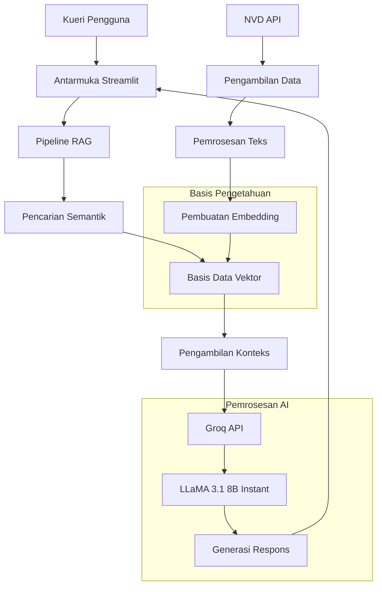
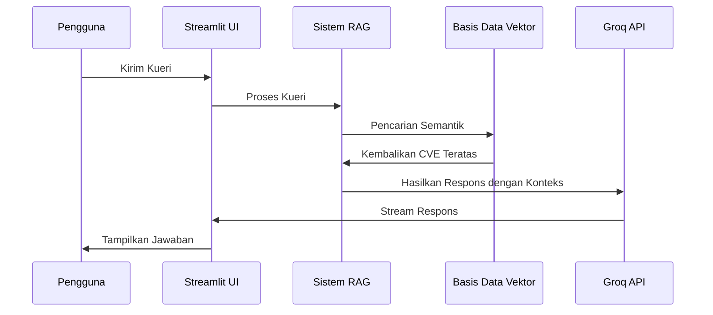

# CyberGuard AI - Sistem RAG Cybersecurity

## Gambaran Umum

CyberGuard AI adalah sistem Retrieval-Augmented Generation (RAG) yang dirancang khusus untuk analisis kerentanan cybersecurity menggunakan data CVE (Common Vulnerabilities and Exposures) dari National Vulnerability Database (NVD).

## Arsitektur Sistem



## Komponen Teknis

### 1. Pipeline Data
- **Sumber Data**: NVD API (National Vulnerability Database)
- **Format Data**: Record CVE JSON
- **Pemrosesan**: Pembagian teks dan pembuatan embedding
- **Penyimpanan**: Embedding vektor dengan metadata

### 2. Pipeline RAG
- **Model Embedding**: sentence-transformers/all-MiniLM-L6-v2
- **Pencarian Vektor**: Similarity Euclidean distance
- **Pengambilan**: Pencarian semantik top-k dengan filter metadata

### 3. Integrasi AI
- **Penyedia LLM**: Groq API
- **Model**: llama-3.1-8b-instant
- **Inferensi**: Generasi respons streaming

## Struktur Proyek

```
CyberSecurityRAG/
├── app.py                 # Antarmuka chatbot Streamlit
├── ambil_data.py          # Pengumpulan data dari NVD API
├── embedding_chunking.py  # Pembuatan dan penyimpanan embedding
├── requirements.txt       # Dependensi Python
├── .env                  # Variabel lingkungan
├── data_cve.json         # Data CVE mentah
├── cve_processed.json    # Data CVE terproses
└── cve_embeddings.pkl    # Embedding vektor
```

## Instalasi & Setup

### Prasyarat
- Python 3.8+
- Akun Groq API
- Akses NVD API

### 1. Clone Repository
```bash
git clone <repository-url>
cd CyberSecurityRAG
```

### 2. Install Dependencies
```bash
pip install -r requirements.txt
```

### 3. Konfigurasi Environment
Buat file `.env`:
```env
GROQ_API_KEY=kunci_api_groq_anda
```

### 4. Persiapan Data
```bash
# Langkah 1: Kumpulkan data CVE dari NVD
python ambil_data.py

# Langkah 2: Buat embedding
python embedding_chunking.py
```

### 5. Jalankan Aplikasi
```bash
streamlit run app.py
```

## Penggunaan

### Pengumpulan Data
Sistem secara otomatis mengambil data CVE dari NVD API dengan fitur berikut:
- Mengambil 500+ record CVE
- Memproses metadata: ID CVE, deskripsi, skor CVSS, severity, produk terdampak
- Mendukung filter rentang tanggal

### Antarmuka Chat
1. **Mulai aplikasi**: `streamlit run app.py`
2. **Ajukan pertanyaan cybersecurity**:
   - "Apa kerentanan XSS terbaru?"
   - "Cari CVE dengan severity critical bulan lalu"
   - "Jelaskan CVE-2024-12345"
3. **Dapatkan respons berbasis AI** dengan konteks CVE

## Konfigurasi

### Pengaturan Model
- **Model Embedding**: all-MiniLM-L6-v2 (384 dimensi)
- **LLM**: llama-3.1-8b-instant
- **Temperature**: 0.3
- **Max Tokens**: 1024

### Parameter Pencarian
- **Hasil Top-k**: 3
- **Metrik Similarity**: Euclidean distance
- **Filter Metadata**: Severity, rentang tanggal

## Fitur

### Kemampuan Inti
- **Pencarian Semantik**: Temukan CVE relevan menggunakan bahasa natural
- **Respons Berkonteks**: Respons AI berdasarkan data CVE
- **Pemrosesan Real-time**: Respons streaming untuk UX yang lebih baik
- **Memori Percakapan**: Mempertahankan konteks chat dalam sesi

### Fitur Teknis
- **Similarity Vektor**: Pengambilan berbasis Euclidean distance
- **Filter Metadata**: Filter berdasarkan severity dan tanggal
- **Penanganan Error**: Fallback yang graceful untuk informasi yang tidak tersedia
- **Respons Streaming**: Generasi respons AI real-time

## Alur Data



## Fitur Keamanan

- **Perlindungan API Key**: Penyimpanan variabel lingkungan
- **Validasi Data**: Sanitisasi dan validasi input
- **Penanganan Error**: Pesan error yang aman tanpa kebocoran informasi
- **Pembatasan Konteks**: Respons ketat berdasarkan data CVE

## Integrasi API

### Groq API
- **Endpoint**: Chat completions
- **Model**: llama-3.1-8b-instant
- **Streaming**: Diaktifkan untuk respons real-time

### NVD API
- **Endpoint**: /rest/json/cves/2.0/
- **Autentikasi**: Tidak diperlukan
- **Batas Rate**: Menghormati panduan NVD API

## Kinerja

### Metrik yang Diharapkan
- **Waktu Respons**: < 5 detik
- **Akurasi**: Respons berbasis konteks
- **Skalabilitas**: 500+ record CVE dengan pencarian efisien

### Optimasi
- **Cache Embedding**: Vektor pre-computed untuk pengambilan cepat
- **Pemrosesan Batch**: Pengambilan data yang efisien
- **Streaming**: Tampilan respons progresif

## Pemecahan Masalah

### Masalah Umum

1. **Error API Key**
   ```
   Solusi: Verifikasi GROQ_API_KEY di file .env
   ```

2. **Embedding Hilang**
   ```
   Solusi: Jalankan python embedding_chunking.py terlebih dahulu
   ```

3. **Batas NVD API**
   ```
   Solusi: Gunakan data sampel yang disediakan atau implementasikan logika retry
   ```

### Log dan Debugging
- Periksa log Streamlit untuk error API
- Validasi keberadaan file data
- Verifikasi integritas file embedding

## Lisensi

Proyek ini untuk tujuan penilaian teknis sebagai bagian dari evaluasi Zentara AI/ML Engineer.

## Kontribusi

Ikuti pola yang telah ditetapkan untuk:
- Fungsi pemrosesan data
- Komponen pipeline RAG
- Konsistensi UI/UX
- Standar penanganan error

## Dukungan

Untuk masalah teknis terkait implementasi ini, lihat:
- Dokumentasi Streamlit
- Dokumentasi Groq API
- Dokumentasi NVD API
- Dokumentasi library Sentence-Transformers

---
