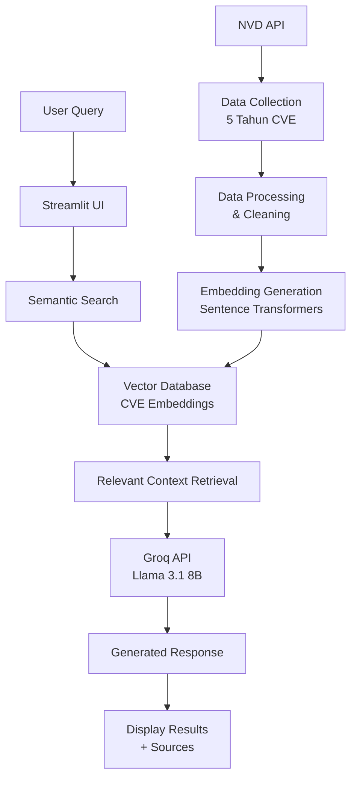

# CyberGuard AI - Sistem Chatbot Cybersecurity dengan RAG

## Deskripsi Proyek

CyberGuard AI adalah sistem chatbot canggih untuk analisis kerentanan cybersecurity yang mengimplementasikan pipeline RAG (Retrieval-Augmented Generation) dengan data CVE (Common Vulnerabilities and Exposures) dari NVD (National Vulnerability Database). Sistem ini dirancang untuk memberikan informasi real-time tentang kerentanan keamanan, analisis risiko, dan rekomendasi mitigasi.

## Fitur Utama

- **Data CVE Komprehensif**: Mengakses database CVE 5 tahun terakhir dari NVD
- **Pencarian Semantik**: Mencari kerentanan menggunakan embedding dan cosine similarity
- **Analisis Real-time**: Analisis kerentanan dengan model LLM terbaru
- **Antarmuka Web Interaktif**: Dashboard Streamlit yang user-friendly
- **Response Akurat**: Kombinasi retrieval information dan generative AI

## Arsitektur Sistem



## Demo Video

Berikut adalah video demonstrasi penggunaan sistem CyberGuard AI:

[![Demo CyberGuard AI]](https://youtu.be/hFEtUu8S1jM)

*Klik gambar di atas untuk menonton video demo di YouTube*

## Teknologi yang Digunakan

### Backend & Processing
- **Python 3.8+** - Bahasa pemrograman utama
- **NVD API** - Sumber data kerentanan resmi
- **Sentence Transformers** - Model embedding untuk semantic search
- **Scikit-learn** - Perhitungan cosine similarity
- **NumPy** - Processing data numerik

### AI & Machine Learning
- **Groq API** - Inference engine dengan Llama 3.1 8B Instant
- **RAG Pipeline** - Retrieval-Augmented Generation architecture
- **Vector Embeddings** - all-MiniLM-L6-v2 model
- **Semantic Search** - Pencarian berbasis makna

### Frontend & Deployment
- **Streamlit** - Framework untuk antarmuka web
- **CSS Custom** - Styling dan user experience
- **Environment Variables** - Management konfigurasi sensitif

## Struktur Proyek

```
cyberguard-ai/
├── ambil_data.py              # Script pengambilan data CVE dari NVD
├── embedding_chunking.py      # Pembuatan embedding dan chunking
├── app.py                     # Aplikasi Streamlit utama
├── requirements.txt           # Dependencies Python
├── .env                      # Environment variables
├── data_cve_5tahun.json      # Data CVE mentah 5 tahun
├── cve_processed_5tahun.json # Data CVE yang sudah diproses
├── cve_embeddings_5tahun.pkl # File embeddings
└── cve_summary_5tahun.json   # Statistik data CVE
```

## Instalasi dan Setup

### Prerequisites
- Python 3.8 atau lebih tinggi
- API Key Groq
- Koneksi internet untuk mengakses NVD API

### Langkah Instalasi

1. **Clone atau download proyek ini**

2. **Buat virtual environment**
```bash
python -m venv venv
source venv/bin/activate  # Windows: venv\Scripts\activate
```

3. **Install dependencies**
```bash
pip install -r requirements.txt
```

4. **Setup environment variables**
Buat file `.env` dan tambahkan:
```env
GROQ_API_KEY=your_groq_api_key_here
```

5. **Ambil dan proses data CVE**
```bash
python ambil_data.py
```

6. **Buat embeddings**
```bash
python embedding_chunking.py
```

7. **Jalankan aplikasi**
```bash
streamlit run app.py
```

## Cara Penggunaan

### 1. Pengambilan Data
Sistem secara otomatis mengambil data CVE 5 tahun terakhir dari NVD API dengan memperhatikan batasan rate limiting.

### 2. Processing Data
Data CVE diproses dan dibersihkan untuk:
- Ekstraksi deskripsi dalam bahasa Inggris
- Parsing metrics CVSS (v2, v3.0, v3.1)
- Identifikasi CWE (Common Weakness Enumeration)
- Formatting tanggal dan metadata

### 3. Embedding Generation
Teks deskripsi CVE diubah menjadi vector embeddings menggunakan model all-MiniLM-L6-v2 untuk memungkinkan pencarian semantik.

### 4. Query Processing
- User memasukkan query melalui antarmuka Streamlit
- Sistem mencari chunk teks yang paling relevan menggunakan cosine similarity
- Context yang relevan dikombinasikan dengan prompt system
- LLM menghasilkan respons berdasarkan context yang tersedia

### 5. Response Display
Hasil ditampilkan dengan:
- Jawaban analisis yang komprehensif
- Daftar sumber CVE yang digunakan
- Similarity score untuk transparansi
- Metadata kerentanan (severity, score, tanggal)

## Contoh Penggunaan

### Query Umum
- "Apa vulnerability kritis yang mempengaruhi Apache Log4j?"
- "CVE terbaru untuk Microsoft Exchange Server?"
- "Vulnerability SQL injection dengan severity tinggi"
- "Rekomendasi mitigasi untuk kerentanan remote code execution"

### Analisis Spesifik
- Perbandingan severity vulnerability
- Trend kerentanan berdasarkan tahun
- Analisis dampak kerentanan spesifik
- Rekomendasi patch dan update

## Batasan Sistem

1. **Data Terbatas**: Hanya mencakup CVE 5 tahun terakhir
2. **Bahasa**: Fokus pada deskripsi bahasa Inggris
3. **Update Manual**: Perlu menjalankan script ulang untuk update data terbaru
4. **Dependency API**: Bergantung pada ketersediaan NVD API dan Groq API

## Keamanan dan Privasi

- Tidak menyimpan data query pengguna
- Menggunakan API key yang aman melalui environment variables
- Hanya mengakses data publik dari NVD
- Tidak memproses data sensitif pengguna

## Pengembangan Selanjutnya

- [ ] Auto-update data CVE harian
- [ ] Support untuk bahasa Indonesia
- [ ] Integrasi dengan sumber threat intelligence tambahan
- [ ] Dashboard analisis dan visualisasi
- [ ] Alert system untuk vulnerability kritikal
- [ ] API endpoint untuk integrasi eksternal

## Troubleshooting

### Masalah Umum

1. **GROQ_API_KEY tidak ditemukan**
   - Pastikan file `.env` ada di root directory
   - Pastikan format file `.env` benar

2. **File embeddings tidak ditemukan**
   - Jalankan `python embedding_chunking.py` terlebih dahulu
   - Pastikan semua script dijalankan secara berurutan

3. **Error connection NVD API**
   - Periksa koneksi internet
   - Tunggu beberapa saat dan coba lagi (rate limiting)

4. **Memory error saat embedding**
   - Kurangi batch size di script embedding
   - Tutup aplikasi lain yang menggunakan memory besar

